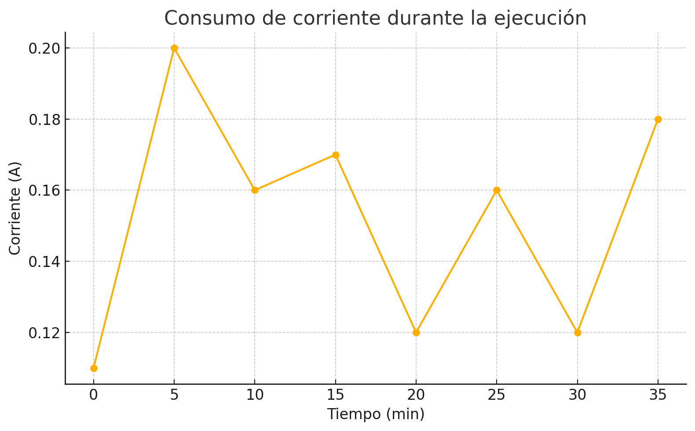

# Cálculo de eficiencia energética (GFLOPS/Watt)

Este archivo documenta cómo se calculó la eficiencia energética de una ejecución del benchmark **HPL Linpack** en el clúster **Cronos**, utilizando mediciones reales de consumo eléctrico.

---

## 📌 Datos de entrada

- **Benchmark:** HPL Linpack  
- **Configuración:** 6 nodos Raspberry Pi 4  
- **Parámetros:** N = 30000, NB = 224, P = 3, Q = 2  
- **Tiempo de ejecución:** 2823,57 segundos (≈ 0,7843 horas)  
- **Rendimiento obtenido:** 6,9112 GFLOPS  

---

## 🔋 Medición de consumo eléctrico

Se midió la corriente cada 5 minutos durante la ejecución completa usando una pinza amperimétrica en la fuente switching de 5 V.  
Los valores registrados fueron:



| Tiempo (min) | Corriente (A) |
|--------------|---------------|
| 0            | 0.11          |
| 5            | 0.20          |
| 10           | 0.16          |
| 15           | 0.17          |
| 20           | 0.12          |
| 25           | 0.16          |
| 30           | 0.12          |
| 35           | 0.18          |

---

## ⚙️ Cálculo del consumo energético

Se utilizó el **método del trapecio** para estimar el área bajo la curva Corriente vs. Tiempo:

```math
\text{Energía (Wh)} ≈ \sum_{i} \frac{I_i + I_{i+1}}{2} \cdot (t_{i+1} - t_i) \cdot V
