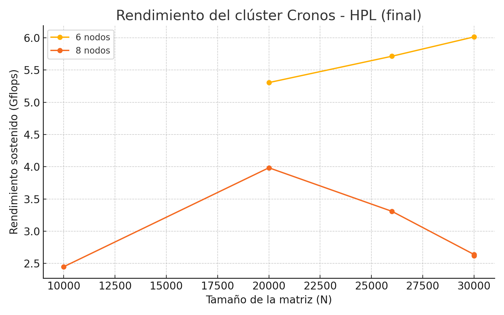

# HPLinpack Benchmarks

## Cálculo de Wh y Eficiencia

Para esta ejecución destacada, se midió la corriente consumida durante 35 minutos en intervalos de 5 minutos, utilizando una pinza amperimétrica conectada a la fuente switching de 5 V. Aplicando el método del trapecio sobre los valores registrados, se estimó un consumo total de 0,448 Wh.

## Gráfico de Resultados

## Resultados de Todas las Pruebas (Cronos)

Nodos | N | NB | P | Q | Tiempo segundos | Gflops | Carpeta | Ejecución |
|-------|-------|-----|---|---|-----------------|---------|-------------|-------------|
6 | 30000 | 128 | 3 | 2 | 3166.42 |  5.6851 |                                 NB128N30000_6nodos |         [hpl_132.out](NB128N30000_6nodos/hpl_132.out)
8 | 30000 | 128|     3 |    2 |           3179.53  |           5.6616 |       NB128N30000_8nodos |         [hpl_136.out](NB128N30000_8nodos/hpl_136.out)
6 | 30000 |  160 |    3 |    2 |           2947.49  |           6.1073 |      NB160N30000_6nodos |         [hpl_131.out](NB160N30000_6nodos/hpl_131.out)
8 | 30000  | 160  |   3  |   2   |         2932.81  |           6.1379 |      NB160N30000_8nodos |         [hpl_135.out](NB160N30000_8nodos/hpl_135.out)
6 | 30000 |  192 |    3  |   2    |        3057.65 |            5.8873 |      NB192N30000_6nodos |        [hpl_130.out](NB192N30000_6nodos/hpl_130.out)
8 | 30000  | 192 |    3  |   2 |           3070.96 |            5.8618  |       NB192N30000_8nodos |      [hpl_134.out](NB192N30000_8nodos/hpl_134.out)
6 | 30000 |   224 |    3  |   2    |        2946.40  |           6.1096 |      NB224N30000_6nodos |            [hpl_129.out](NB224N30000_6nodos/hpl_129.out)
8 | 30000 |  224 |    3  |   2 |           2949.44  |           6.1033 |      NB224N30000_8nodos |            [hpl_133.out](NB224N30000_8nodos/hpl_133.out)

