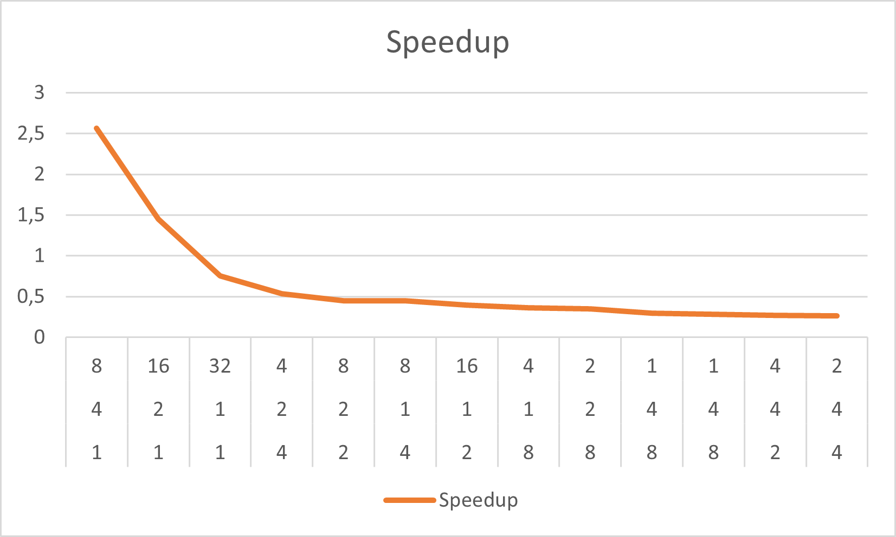
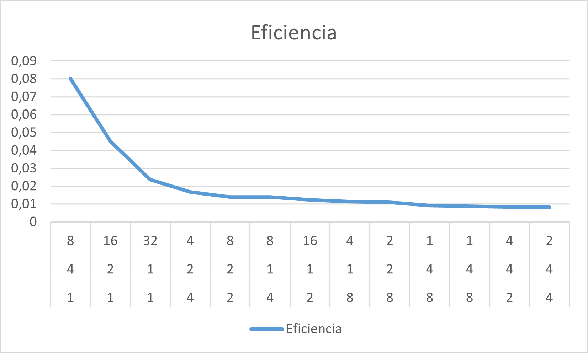

# Cálculo de π en paralelo

Este experimento evalúa el rendimiento de diferentes estrategias de paralelización (MPI puro, OpenMP e híbrida MPI + OpenMP) para calcular la integral que aproxima π aplicando la regla del punto medio.  
Las pruebas se ejecutaron en el clúster **Cronos**, variando cantidad de nodos, procesos MPI e hilos OpenMP.

## Organización del directorio

| Carpeta / Archivo | Descripción |
|-------------------|-------------|
| `pi-mpi.c`, `pi-hib.c` | Implementaciones en C para MPI y para versión híbrida (MPI + OpenMP). |
| `pi-mpi`, `pi-hib` | Ejecutables resultantes compilados en el clúster. |
| `mpi-job.sh`, `hib-job.sh` | Scripts de envío de trabajos a SLURM. |
| `*.dat` | Archivos de configuración con el número de intervalos a integrar. |
| `mpi-out.*`, `mpi-err.*` | Salida estándar y de error por ejecución (ver [`EJECUCIONES.md`](EJECUCIONES.md)). |
| `Mediciones.xlsx`, `Mediciones_ConGraficos.xlsx` | Planillas con datos crudos y gráficos. |
| `Salidas.txt` | Resumen textual de runs seleccionadas. |

## Compilación

```bash
@TODO: Ver el código de compilación real
# Compilación solo-MPI
mpicc -O3  -o pi-mpi pi-mpi.c

# Compilación híbrida MPI + OpenMP
mpicc -O3 -fopenmp  -o pi-hib pi-hib.c
```

## Ejecución típica

```bash
# Ejemplo: 4 procesos MPI (1 nodo) y 8 hebras OpenMP (2 por proceso)
export OMP_NUM_THREADS=2
srun -N1 -n4 ./pi-hib 1000000000
```

Los scripts `mpi-job.sh` y `hib-job.sh` automatizan el envío de lotes a SLURM, ajustando `OMP_NUM_THREADS` y la repartición de tareas por nodo.

## Resultados de rendimiento

| Nodos | Núcleos | Hilos | Total procesos | Tiempo (s) | Speedup | Eficiencia |
|-------|---------|-------|----------------|------------|---------|------------|
| 1 | 4 | 8  | 32 | 0,004275 | 2,56467836 | 0,0801462 |
| 1 | 2 | 16 | 32 | 0,007576 | 1,44720169 | 0,04522505 |
| 1 | 1 | 32 | 32 | 0,014527 | 0,75473257 | 0,02353859 |
| 2 | 2 | 4  | 32 | 0,020608 | 0,53202640 | 0,01662582 |
| 2 | 2 | 8  | 32 | 0,024538 | 0,44681718 | 0,01396304 |
| 4 | 1 | 8  | 32 | 0,024601 | 0,44567294 | 0,01398728 |
| 2 | 1 | 16 | 32 | 0,027873 | 0,39335558 | 0,01229236 |
| 8 | 1 | 4  | 32 | 0,030460 | 0,35997477 | 0,01124836 |
| 2 | 2 | 2  | 32 | 0,031256 | 0,35078065 | 0,01096190 |
| 4 | 1 | 4  | 32 | 0,037455 | 0,29272460 | 0,00931746 |
| 8 | 4 | 1  | 32 | 0,039273 | 0,29717399 | 0,00872419 |
| 4 | 2 | 2  | 32 | 0,040867 | 0,26828492 | 0,00838389 |
| 4 | 4 | 2  | 32 | 0,041933 | 0,26146472 | 0,00817070 |

### Gráfico

Los gráficos de tiempo, speedup y eficiencia se encuentran en la pestaña **Gráficos** de [`Mediciones_ConGraficos.xlsx`](./Mediciones_ConGraficos.xlsx).  





---

*CACIC 2025 – Medición de performance en clusters HPC.*